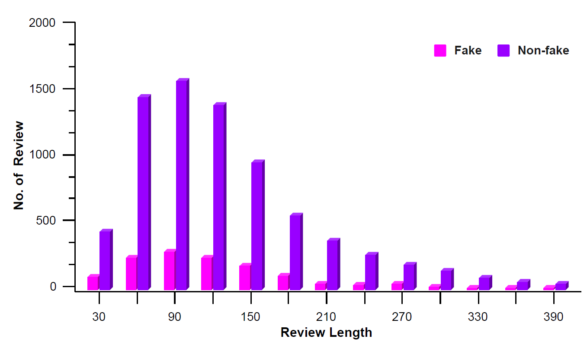
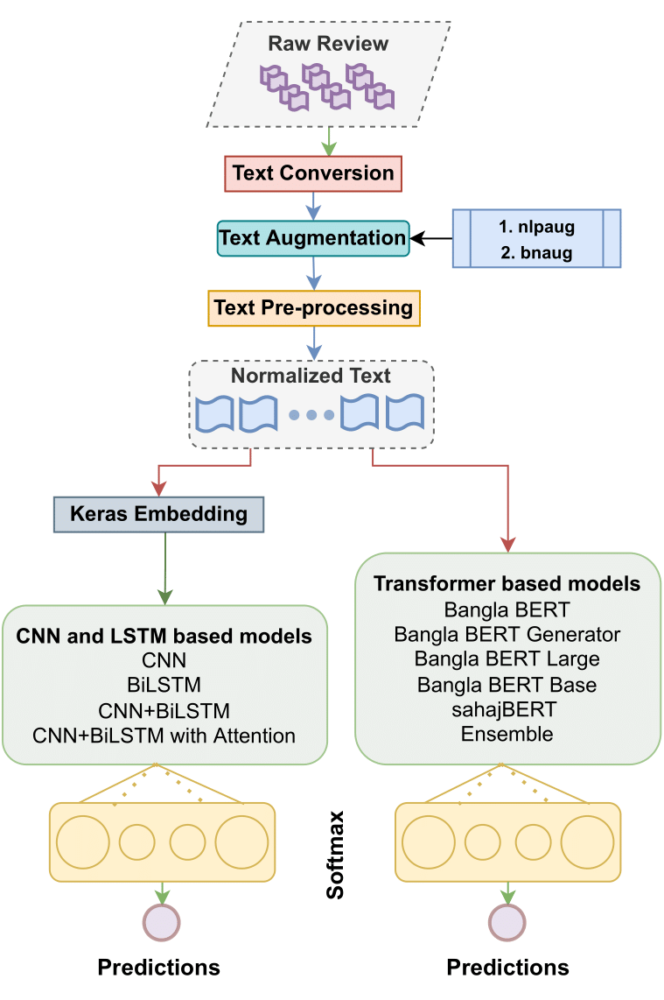
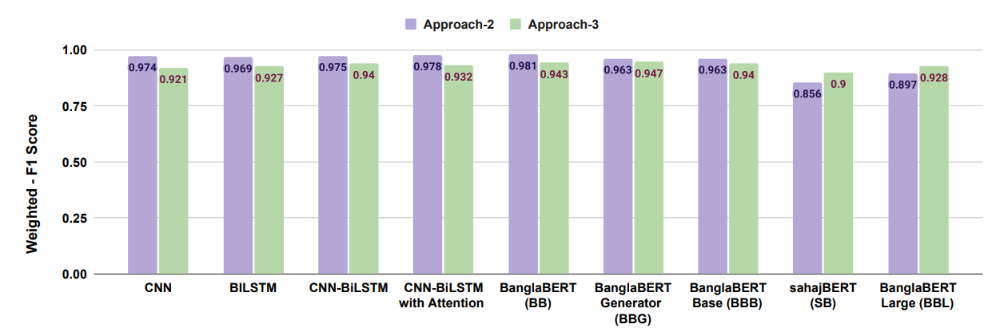
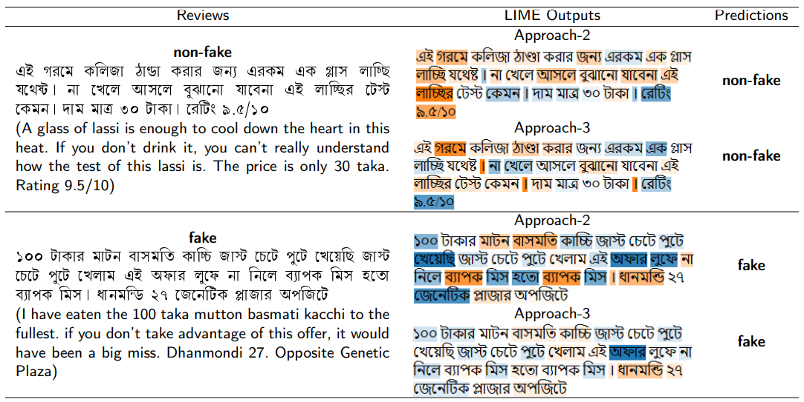

# Bengali Fake Reviews: A Benchmark Dataset and Detection System

This paper introduces the Bengali Fake Review Detection (BFRD) dataset, the first publicly 
available dataset for identifying fake reviews in Bengali. The dataset consists of 7710 non-fake 
and 1339 fake food-related reviews collected from social media posts. To convert non-Bengali 
words in a review a unique pipeline has been proposed that translates English words to their 
corresponding Bengali meaning and also back transliterates Romanized Bengali to Bengali. 
We have conducted rigorous experimentation using multiple deep learning and pre-trained transformer 
language models to develop a reliable detection system. Finally, we propose a weighted ensemble model 
that combines four pre-trained transformers: *BanglaBERT, BanglaBERT Base, BanglaBERT Large* and *BanglaBERT Generator*.

- The paper **"Bengali Fake Reviews: A Benchmark Dataset and Detection System"** is published in [Neurocomputing](https://www.sciencedirect.com/journal/neurocomputing), a **Q1 journal** by Elsevier (Impact Factor 6).

- **Paper Link**: https://www.sciencedirect.com/science/article/abs/pii/S0925231224005034

- **Paper PDF**: https://arxiv.org/pdf/2308.01987

## Repository Structure
The repository has two folders:

+ **Codes**: All the codes for deep learning models, transformers, ensemble model and text conversion pipeline are available.
	
	- **Fine-tuned BanglaBERT on HuggingFace**: https://huggingface.co/shawon95/BengaliFakeReviewDetection

+ **Dataset**: Contains two excel files (a) fake.xlsx (b) non-fake.xlsx. Each excel file contains two columns: **Review** (collected raw reviews), **Label** (annotations).

	- **BFRD Dataset on HuggingFace**: https://huggingface.co/datasets/shawon95/Bengali-Fake-Review-Dataset

	- **BFRD Dataset on Kaggle**: https://www.kaggle.com/datasets/shawontanvir/bengali-fake-review-dataset
	
	- **BFRD on paperswithcode**: https://paperswithcode.com/dataset/bfrd


## Dataset Statistics 
- Annotated by 4 native Bangla speakers with more than 90% trustworthiness score.
- Fleiss' Kappa Score: 0.83
- Number of Total Data

	- Fake - 1339
	- Non-fake - 7710

- Class wise statistics of BFRD dataset

|       **Statistics**       | **Fake** | **Non-fake** |
|--------------------------|---------|-------------|
|         Total words        | 1,55,789 |   9,27,902   |
|     Total unique words     |  17,739  |    51,200    |
|      Max Review length     |    693   |     1,614    |
|    Avg number of  words    |  116.35  |    120.35    |
| Avg number of unique words |   84.99  |     88.42    |

- Class wise ratio of number of reviews with respect to the review length


## Methodology


## Result Comparison


## Example Explanation


## Citation
If you use the dataset, please cite the following paper:
```
@article{SHAHARIAR2024127732,
title = {Bengali fake reviews: A benchmark dataset and detection system},
journal = {Neurocomputing},
pages = {127732},
year = {2024},
issn = {0925-2312},
doi = {https://doi.org/10.1016/j.neucom.2024.127732},
url = {https://www.sciencedirect.com/science/article/pii/S0925231224005034},
author = {G.M. Shahariar and Md. Tanvir Rouf Shawon and Faisal Muhammad Shah and Mohammad Shafiul Alam and Md. Shahriar Mahbub},
keywords = {Bengali fake reviews detection, Ensemble learning, Transformers, Deep learning, Augmentation, Transliteration},
abstract = {The proliferation of fake reviews on various online platforms has created a major concern for both consumers and businesses. Such reviews can deceive customers and cause damage to the reputation of products or services, making it crucial to identify them. Although the detection of fake reviews has been extensively studied in English language, detecting fake reviews in non-English languages such as Bengali is still a relatively unexplored research area. The novelty of the study unfolds on three fronts: (i) a new publicly available dataset called Bengali Fake Review Detection (BFRD) dataset is introduced, (ii) a unique pipeline has been proposed that translates English words to their corresponding Bengali meaning and also back transliterates Romanized Bengali to Bengali, (iii) a weighted ensemble model that combines four pre-trained transformers model is proposed. The developed dataset consists of 7710 non-fake and 1339 fake food-related reviews collected from social media posts. Rigorous experiments have been conducted to compare multiple deep learning and pre-trained transformer language models and our proposed model to identify the best-performing model. According to the experimental results, the proposed ensemble model attained a weighted F1-score of 0.9843 on a dataset of 13,390 reviews, comprising 1339 actual fake reviews, 5,356 augmented fake reviews, and 6695 reviews randomly selected from the 7710 non-fake instances.}
}
```
